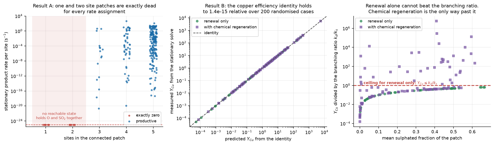

# Results

Everything below is a property of the model that is defined in this repository. None of it has been validated against experiment. Read [LIMITATIONS.md](LIMITATIONS.md) before quoting any number.

## The model

Each surface site carries one substrate phase and at most one adsorbate. The phase is metallic copper, copper oxide or copper sulphate. The adsorbate is nothing, atomic oxygen, SO2 or SO3.

The elementary steps are the following. Oxygen arrives as O2 and dissociates onto two neighbouring vacant oxide sites, so it needs a pair. SO2 adsorbs on a single vacant oxide site and can desorb again. An adsorbed SO2 reacts with an adsorbed oxygen atom on a neighbouring site to give an adsorbed SO3, which is the productive step. That adsorbed SO3 then either desorbs as product or reacts into the lattice as sulphate, which is the branch point that decides everything. A sulphated site can decompose back to oxide, and freshly exposed metallic copper reoxidises.

The branch between product desorption and sulphation is the whole model. Both channels draw on the same adsorbed SO3 population, so their rates stand in a fixed ratio set by the two rate constants.



## Result A: three sites are the minimum for a nonzero rate

On a connected patch of active oxide sites, with all other surface sites permanently inactive, the stationary rate of product formation is exactly zero for one site and for two sites, and strictly positive for three or more.

The reason is an accessibility argument rather than a rate argument. A single site has no neighbour, so the bimolecular productive step can never fire. On a pair, the only source of adsorbed oxygen is O2, which lands on two empty neighbours and fills both of them. After it lands there is no vacant site left for SO2, and removing an oxygen atom requires the reverse step, which takes both atoms away together. Starting from an empty patch, no reachable configuration holds an oxygen atom and an SO2 at the same time. On three connected sites there is always a path a to b to c, so oxygen can land on the pair a and b, SO2 can then adsorb on the still vacant c, and the reaction fires across b and c.

Every connected graph on three or more vertices contains such a path, because a connected graph in which no vertex has two or more neighbours is at most a single edge. The criterion is therefore the number of sites in the connected component and not its shape.

This is checked in two independent ways in `src/structure_theory.py`. The reachability test uses integer logic only and treats every rate as merely possible, so its answer depends on the patch shape alone. The numerical test solves the stationary master equation for randomised rate constants spanning nine orders of magnitude. Across 248 cases covering every connected graph up to five sites, there were no violations, and every patch predicted to be dead produced exactly zero.

One practical caution follows from this. When rate constants are extreme, the stationary rate on a live patch can fall to solver precision, and in a finite stochastic run it can produce no events at all. Neither of those is evidence that the true rate is zero. An earlier version of this work made that mistake, and it is recorded in [CORRECTIONS.md](CORRECTIONS.md).

## Result B: an exact ceiling on product per copper atom consumed

Consider a patch that is periodically discarded and replaced by fresh metallic copper, which then reoxidises. Each reset spends the copper in that layer, including any part of it that had not finished oxidising.

Write `k_d` for product desorption from adsorbed SO3 and `k_s` for sulphation from the same intermediate. Both event rates are proportional to the population of that one intermediate, so

```
R_product_direct / R_sulphation = k_d / k_s
```

At stationary state the sulphate created must equal the sulphate destroyed. With resets at frequency `gamma` on a patch of `n` sites, and a chemical regeneration channel that returns sulphate to oxide without spending copper,

```
R_sulphation = R_regeneration + gamma * n * f_sulphate
```

Dividing the total product by the copper spend `gamma * n`, and writing `rho` for the regenerations per copper atom exposed, gives

```
Y_Cu = (1 + k_d / k_s) * rho + (k_d / k_s) * f_sulphate
```

With no regeneration channel this reduces to `Y_Cu = (k_d / k_s) * f_sulphate`, which cannot exceed `k_d / k_s` because the sulphated fraction cannot exceed one. That ceiling is independent of patch shape, diffusion, reoxidation speed and reset frequency. No arrangement of the surface and no renewal schedule can overcome a poor branching ratio.

With regeneration switched on, the first term has no ceiling and grows as the reset frequency falls. Chemical regeneration is therefore the only route past the renewal limit in this model.

The identity was checked across 200 randomised cases covering four patch shapes, with sulphation and desorption rates drawn over five orders of magnitude and regeneration switched off in a third of them. The maximum relative error was 5.6e-6, which is solver precision. In the cases without regeneration the largest observed value of `Y_Cu` divided by `k_d / k_s` was 0.665, which respects the ceiling. With regeneration the same quantity reached 5.7e6.

Numerical agreement here is a conservation check and a demonstration of the derivation. It is not independent evidence of new physics, because the identity follows from the event balances that the solver is already enforcing.

### Why this matters for a renewing catalyst

Throughput and material efficiency pull in opposite directions. Resetting the surface more often keeps the sulphated fraction low and raises the rate per site, and it also spends copper faster. The table below uses one illustrative barrier set on a square patch with fast reoxidation.

| Reset frequency (1/s) | Product per site per second | Product per copper atom exposed |
| ---: | ---: | ---: |
| 0.01 | 0.443 | 44.28 |
| 0.1 | 2.023 | 20.23 |
| 1 | 5.668 | 5.668 |
| 100 | 262.3 | 2.623 |
| 3162 | 1910 | 0.604 |

The fast end of that table is a mathematical stress test rather than a proposed operating point. At slow reoxidation the picture inverts, because resetting too often leaves mostly bare metal, which is inactive in this scheme. There is therefore an optimum reset rate set by the ratio of reset frequency to reoxidation rate, and a renewal strategy that maximises shedding is not automatically good.

## Result C: patch shape matters, and its ranking is not robust

At equal site count and equal bond count, different patch shapes give different rates. A four site star and a four site chain both have four sites and three bonds, and under one illustrative barrier set their rates differ by a factor of 2.94.

That ranking does not survive a change of mechanism or of rates. A deliberately simple lattice oxygen control, in which SO2 consumes a lattice oxygen atom directly and O2 refills adjacent vacancy pairs, inverts the ordering, giving a star to chain ratio between 0.712 and 0.994 across refill to consumption ratios from 0.01 to 100. Under the original mechanism, a joint sweep of 100 random parameter draws gave star to chain ratios from 0.783 to 272.2, with the star ahead in only 88 of the 100 draws. Diffusion changes the advantage as well.

The conclusion is that shape ranking on its own does not identify the oxygen mechanism. The inversion is a useful hypothesis for designing an experiment and it is not a unique diagnostic. The stricter distinction from Result A, that a pair is dead and three sites are not, does survive the rate and diffusion changes that were tested, although it could still change if additional elementary paths exist.

## Result D: the population of usable patches

At 90 percent random blocking of a square lattice, the fraction of surviving active sites sitting in isolated single sites is `(1-q)^4` and the fraction in isolated pairs is `4q(1-q)^6`, with `q` the surviving fraction of 0.1. Together those account for 86.868 percent of the surviving sites, which by Result A can produce nothing. The remaining 13.132 percent sit in components of at least three sites.

Direct simulation on a 128 by 128 lattice gives 13.213 percent with a standard error of 0.215. Moving to a six neighbour lattice raises it to 21.253 percent with a standard error of 0.262, so coordination number changes the usable population substantially.

A finite productive patch does not need a surface spanning cluster, so describing this as a percolation threshold would be misleading. What matters is the size distribution of small components and not the existence of an infinite one.
